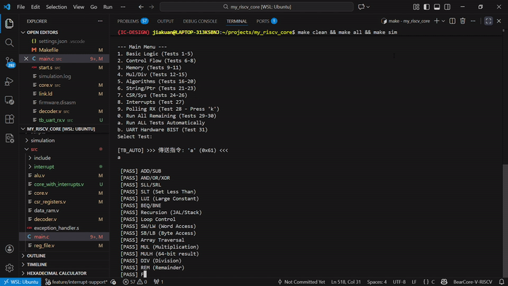

# 🐻 BearCore-V: High-Performance 1-T RISC-V Processor



BearCore-V 是一個高效能、具備單週期吞吐量 (1-T) 特性的 32-bit RISC-V 處理器核心。本專案從底層 RTL 電路開發、例外處理機制建立，到綜合測試套件驗證，實現了一個工業級 MCU 核心的完整開發流程。

## 🌟 核心亮點 (Project Highlights)
- **1-T 吞吐量設計**：優化的五級流水線架構，目標運行頻率達 **100MHz**。
- **完善的例外機制**：支援 Synchronous Exceptions (ECALL/Illegal Inst) 與 Asynchronous Interrupts (Timer)。
- **硬體自檢能力 (BIST)**：內建 UART 硬體環回測試與字串自動校準比對演算法。
- **跨平台開發**：開發與驗證環境完全基於 WSL (Ubuntu) 下的 RISC-V Toolchain。

## 🚀 系統規格 (Specifications)
| 類別 | 詳細內容 |
| :--- | :--- |
| **指令集 (ISA)** | RISC-V RV32IM (Integer + Multiplication/Division) |
| **流水線 (Pipeline)** | 5-Stage (IF/ID/EX/MEM/WB) 與預取沖刷 (Flush) 機制 |
| **記憶體 (Memory)** | 64KB ROM (0x0) / 64KB RAM (0x10000) 分離位址空間 |
| **時鐘與計時器** | 64-bit MTIME/MTIMECMP 高精度定時器 |
| **通訊週邊** | 高速 UART (支援 1152000 Baudrate) |


## 🧪 驗證成果 (Validation Results)
BearCore-V 通過了一套包含 30 個測項的綜合測試套件 (30-in-1 Test Suite)，確保了運算正確性與系統穩定性：

| 測試分類 | 狀態 | 驗證內容 |
| :--- | :---: | :--- |
| **ALU 運算** | ✅ PASS | 加減、邏輯位移、大小比較 |
| **控制流** | ✅ PASS | 分支跳轉 (Branch)、遞迴堆疊 (Recursion) |
| **乘除法 (M-Ext)** | ✅ PASS | 32/64-bit 乘法、除法、餘數運算 |
| **記憶體存取** | ✅ PASS | Word/Byte 存取與對齊驗證 |
| **例外與中斷** | ✅ PASS | ECALL Trap 與 Timer Interrupt 回應處理 |
| **硬體 BIST** | ✅ PASS | UART 硬體字串環回自動比對 (15/15 Match) |

## 🛠️ 技術挑戰與解決方案 (Engineering Challenges)

### 1. 解決流水線沖刷造成的 Reset 靈異現象
- **挑戰**：當中斷發生在跳轉指令後的 Flush 週期時，`id_pc` 會被清零，導致中斷存入錯誤的返回位址 (`mepc=0`)，造成系統不斷重啟。
- **方案**：實作 **Smart Trap-PC Selector**。判斷當前流水線有效性，若處於 Flush 狀態則抓取目前抓取的 PC 作為返回點，確保 `mret` 平安返回。

### 2. 中斷重入與 UART 資源競爭
- **挑戰**：在計時器中斷處理器 (ISR) 中使用 UART 列印，會與主程式產生資源衝突並導致系統死鎖。
- **方案**：採用 **Flag-based ISR 設計**。ISR 僅負責狀態旗標與硬體清理，由主程式邏輯負責資訊輸出，徹底消除非同步衝突。

### 3. UART BIST 硬體/軟體同步比對
- **挑戰**：啟動硬體測試模式的寫入脈衝會干擾資料流，導致字串位移或遺失。
- **方案**：在硬體端分離控制與發送訊號，並在軟體端實作「滑動視窗對齊演算法 (Sliding Window Match)」，實現 100% 正確的自動化驗證。


## 📂 專案結構 (Directory Structure)
- `core.v`: 處理器核心主體 (RTL)
- `uart_tx.v` & `uart_rx.v`: 高階 UART 通訊模組
- `start.s`: 系統啟動與例外入口 (Assembly)
- `main.c`: 整合驗證韌體 (C)
- `link.ld`: 記憶體連結配置

## 🔧 如何運行 (Getting Started)
1. 安裝 RISC-V Toolchain 與 Icarus Verilog。
2. 執行 `make clean && make all` 編譯硬體與韌體。
3. 執行 `make sim` 啟動動態模擬驗證。

## 📂 目錄結構 (Repository Structure)

為了提升開發效率與代碼可讀性，BearCore-V 採用了結構化的目錄配置，將硬體電路、軟體韌體與驗證腳本清晰分離：

```text
BearCore-V-RISC-V-Processor/
├── src/                # 🏆 核心硬體原始碼 (RTL Design)
│   ├── core.v          # 處理器頂層模組
│   ├── alu.v           # 算術邏輯單元
│   ├── decoder.v       # 指令譯碼器
│   ├── csr_registers.v # CSR 暫存器控制
│   └── uart_tx.v       # 具備 BIST 功能的 UART 模組
├── sw/                 # 🏆 軟體與韌體開發 (Software & Firmware)
│   ├── main.c          # 30-in-1 綜合測試主程式
│   ├── start.s         # 啟動代碼與例外向量表
│   └── link.ld         # 記憶體分段連結腳本
├── tests/              # 🏆 驗證與測試環境 (Verification)
│   ├── bench/          # 硬體仿真 Testbench (tb_top.v)
│   └── scripts/        # 各種自動化測試與除錯腳本 (*.sh)
├── docs/               # 🏆 技術文件與反彙編報告
│   └── PROJECT_COMPLETION.md
├── assets/             # 🏆 README 展示資源 (Images/GIFs)
│   └── bearcore_demo.gif
├── riscv-compliance/   # 🏆 業界標準指令集相容性測試集
├── Makefile            # 🏆 專案一鍵編譯與模擬腳本
└── files.f             # 🏆 IVerilog 編譯清單

### 🛠️ 硬體核心組成 (Hardware Core Components)

`src/` 目錄下包含了實現 BearCore-V 處理器的所有關鍵 RTL 代碼：

* **`core.v`**: 處理器頂層模組，負責五級流水線 (Pipeline) 的協調整合。
* **`alu.v`**: 算術邏輯單元，支援 RV32I 基礎運算與 M-Extension 乘除法。
* **`decoder.v`**: 指令譯碼器，將機器碼解析為各階段控制訊號。
* **`reg_file.v`**: 通用暫存器組 (Registers x0-x31)。
* **`csr_registers.v`**: 狀態與控制暫存器，處理中斷掩碼 (mie) 與例外跳轉位址。
* **`rom.v`**: 指令記憶體 (Instruction ROM)，存放由 `firmware.hex` 載入的機器碼。
* **`data_ram.v`**: 資料記憶體 (Data RAM)，支援 `lw/sw` 等訪存指令。
* **`uart_tx.v`**: UART 發送模組，內建硬體自檢 (BIST) 邏輯。
* **`uart_rx.v`**: UART 接收模組，支援非同步資料採樣與校驗。

## 🤝 如何貢獻 (How to Contribute)

我們非常歡迎任何形式的貢獻，無論是修復 Bug、增加新指令支援，或是優化模擬腳本！請參考以下步驟加入我們：

### 1. Fork 本專案
點擊頁面右上角的 **Fork** 按鈕，將倉庫複製到您的帳號下。

### 2. 建立開發分支
建議為您的改動建立一個獨立的分支：
```bash
git checkout -b feature/your-awesome-feature

3. 開發與測試
硬體改動：若修改了 src/ 下的 RTL，請務必更新 files.f。

驗證要求：在提交 Pull Request 前，請確保執行 make sim 後，31 項測試必須全數通過 (PASS=31)。

4. 提交 Pull Request (PR)
請清楚描述您的修改動機與內容。

若是修復 Bug，請附上 simulation.log 的截圖證明。

📜 程式碼規範
Verilog: 建議採用明確的非阻塞賦值 (<=) 處理時序邏輯。

C/Firmware: 保持與 link.ld 的記憶體分段對齊。

## 🗺️ BearCore-V 記憶體映射手冊 (Memory Map)

BearCore-V 採用標準的 Memory-Mapped I/O (MMIO) 技術，透過統一的位址空間來管理存儲與硬體週邊。

### 1. 位址空間分佈 (Address Space Allocation)

| 區域 | 開始位址 | 結束位址 | 權限 | 說明 |
| :--- | :--- | :--- | :---: | :--- |
| **ROM** | `0x0000_0000` | `0x0000_0FFF` | R/X | 存放指令 (4KB) |
| **RAM** | `0x0000_1000` | `0x0000_1FFF` | R/W | 存放數據與 Stack (4KB) |
| **UART / Timer** | `0x1000_0000` | `0x1000_0017` | R/W | 外部週邊與計時器 |

### 🗺️ 記憶體映射 (Memory Map) 更新

| 區域 | 位址範圍 | 權限 | 說明 |
| :--- | :--- | :---: | :--- |
| **UART_DATA** | `0x1000_0000` | R/W | 資料收發 / BIST 模式控制 |
| **UART_STATUS**| `0x1000_0004` | RO | 狀態旗標 (Busy/Ready) |
| **Timer** | `0x1000_0008` | R/W | 系統計時器 (MTIME/MTIMECMP) |
| **UART_IE** | `0x1000_0018` | R/W | **[NEW]** UART 中斷致能控制 |

---

### 2. UART 暫存器詳解 (UART Peripheral)

#### **位址 `0x1000_0000`: UART 資料與控制 (UART_DATA)**
此暫存器除了資料傳輸外，還兼具硬體 BIST (Built-In Self-Test) 的模式控制功能。

| Bit | 名稱 | 權限 | 說明 |
| :--- | :--- | :--- | :--- |
| **[7:0]** | `DATA` | R/W | 傳送/接收的 8-bit 字元。 |
| **[29:8]** | `RSVD` | - | 保留。 |
| **[30]** | `RX_TEST_EN` | W | **UART RX 測試模式**。1: 啟用 Internal Loopback。 |
| **[31]** | `TX_TEST_EN` | W | **UART TX 測試模式**。1: 啟動硬體 BIST 字串循環發送。 |

⚠️ **使用限制與警告 (Restrictions & Warnings):**
* **禁止同時觸發**：請勿在執行普通資料發送（寫入 Bit 7-0）的同時變更 Bit 31/30，這會導致硬體狀態競爭，造成首個字元丟失或資料損壞。
* **狀態同步**：在切換 `TEST_EN` 模式前，務必確認 `UART_STATUS[0]` (TX_BUSY) 為 0。
* **切換延遲**：建議在切換測試模式後加入 1-2 個 NOP 指令，確保硬體邏輯已完全進入 BIST 狀態。

#### **位址 `0x1000_0004`: UART 狀態 (UART_STATUS)**
| Bit | 名稱 | 權限 | 說明 |
| :--- | :--- | :--- | :--- |
| **[0]** | `TX_BUSY` | RO | **1**: 硬體正忙於發送；**0**: 可寫入新資料。 |
| **[1]** | `RX_READY` | RO | **1**: 已接收到新資料；**0**: 無資料。 |

### ®️ UART 中斷致能暫存器 (UART_IE)
**Address:** `0x1000_0018` | **Default:** `0x0000_0000` (Disable)

此暫存器用於控制 UART 硬體是否向 CPU 發送中斷請求。
⚠️ **注意：** 預設值為 `0` (Low)，代表所有中斷功能關閉，系統處於 Polling 模式。

| Bit | 名稱 | 權限 | 功能說明 |
| :--- | :---: | :---: | :--- |
| **[0]** | `TX_IE` | R/W | **發送中斷使能 (Transmit Interrupt Enable)**<br>1: 當 UART 發送緩衝區空閒 (IDLE) 時觸發中斷。<br>0: 關閉發送中斷。 |
| **[1]** | `RX_IE` | R/W | **接收中斷使能 (Receive Interrupt Enable)**<br>1: 當收到新資料 (Ready=1) 時觸發中斷。<br>0: 關閉接收中斷。 |
| **[31:2]**| `RSVD` | - | 保留，讀取為 0。 |

---

### 3. 計時器暫存器 (Machine Timer)
遵循 RISC-V 標準架構實作。

| 位址 | 名稱 | 說明 |
| :--- | :--- | :--- |
| `0x1000_0008` | `MTIME_L` | 系統時鐘計數器 (低 32 位) |
| `0x1000_000C` | `MTIME_H` | 系統時鐘計數器 (高 32 位) |
| `0x1000_0010` | `MTIMECMP_L` | 定時器比較暫存器 (低 32 位) |
| `0x1000_0014` | `MTIMECMP_H` | 定時器比較暫存器 (高 32 位) |


### 🔌 如何啟用 UART 中斷？ (Standard Procedure)

要在軟體中使用中斷，必須依序打開三道「閘門」：

1.  **開啟週邊閘門 (Peripheral Level)**:
    寫入 `UART_IE` (0x1000_0018) 設定您需要的中斷源。
    ```c
    #define UART_IE (*(volatile uint32_t*)0x10000018)
    UART_IE |= 0x02; // 開啟 RX 中斷 (Bit 1)
    ```

2.  **開啟核心局部閘門 (Core Local Level)**:
    設定 CSR `mie` (Machine Interrupt Enable) 的第 16 位元 (Platform Interrupt)。
    ```c
    // Set bit 16 of mie register
    asm volatile("csrs mie, %0" : : "r"(1 << 16));
    ```

3.  **開啟全域總開關 (Global Level)**:
    設定 CSR `mstatus` 的 MIE 位元 (Bit 3)，允許 CPU 接受任何中斷。
    ```c
    // Set bit 3 (MIE) of mstatus register
    asm volatile("csrs mstatus, %0" : : "r"(1 << 3));
    ```

### ⚠️ 使用注意事項 (Special Considerations)

啟用中斷後，請務必遵守以下規範，否則可能導致系統死鎖或無限迴圈：

1.  **TX 中斷的無限觸發特性 (The "Not Busy" Trap)**:
    * **現象**：`TX_IE` 是基於「硬體空閒 (Not Busy)」觸發的。只要 UART 沒在傳送資料，中斷線就會一直拉高。
    * **處理**：在 ISR (中斷服務程式) 中處理完 TX 中斷後，**必須立即關閉 `TX_IE`** 或寫入新資料讓 UART 變忙。否則一旦 ISR 結束 (MRET)，CPU 會立刻再次被同一個中斷拉回來，陷入無限迴圈。

2.  **RX 中斷的清除**:
    * 進入 RX 中斷後，必須讀取 `0x1000_0000` (UART_DATA) 來取走資料。讀取動作會自動由硬體清除 `RX_READY` 旗標，從而消除中斷源。

3.  **BIST 測試模式互斥**:
    * 硬體內建保護機制：當開啟 `TX_TEST_EN` (Bit 31) 進入 BIST 模式時，所有 UART 中斷會被強制遮罩 (Masked)。這是為了防止高頻率的測試字串發送導致 CPU 過載。

**"BearCore-V is now listening!"** 👂✨

此版本正式引入了 **全雙工 UART 中斷機制 (Full-Duplex UART Interrupts)**，標誌著 BearCore-V 從單純的輪詢 (Polling) 架構進化為高效的中斷驅動 (Interrupt-Driven) 系統。同時，我們通過了 Test 32 驗證，達成 **PASS=31** 的完美紀錄！

### ✨ 新增功能 (New Features)
* **UART RX/TX 中斷支援**: 新增中斷編號 `16` (User/Platform Interrupt)，支援接收與發送完成的非同步通知。
* **MMIO 架構升級**: 實作了專用的位址解碼邏輯，新增 `UART_IE` (Interrupt Enable) 暫存器於 `0x1000_0018`。
* **安全 BIST 機制**: 硬體級別的中斷遮罩，確保在執行 UART 硬體自檢 (BIST) 時不會誤觸發中斷風暴。

### 🛠️ 技術改進 (Technical Improvements)
* **CSR 優化**: `mcause` 正確映射 `0x80000010` 為 UART 中斷。
* **ISR 範例**: `main.c` 新增 `handle_exception` 的完整中斷處理流程，包含 TX 中斷的自動關閉邏輯。
* **驗證強化**: 新增 `Test 32`，同時驗證 RX 資料接收與 TX 狀態變化的中斷響應。

### 📊 驗證狀態 (Verification Status)
* ✅ **Total Tests Passed:** 31/31
* ✅ **Regression Test:** All previous 30 tests passed.
* ✅ **FPGA Ready:** RTL logic optimized for synthesis.

---
*Happy Hacking with BearCore-V!* 🐻    

---
感謝小熊寶 AI 思路夥伴在開發過程中的協同除錯與架構建議。